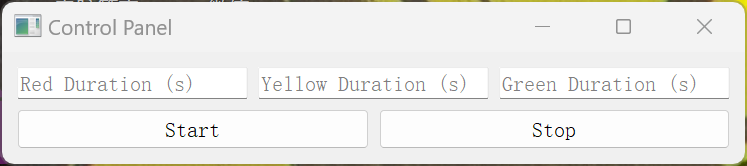
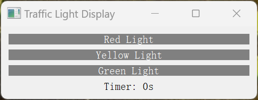

# CS132: Software Engineering

# HW4: PyQt Practice

Create a traffic light simulation with two UI interfaces using PyQt5. One interface is the control panel, and the other is the traffic light display. You could skip to **About the Codes** part for usages of codes.

## Requirements:

### 1. Control Panel:

- The control panel should allow the user to set the duration for the three lights (red, yellow, and green).
- It should have "Start" and "Stop" buttons.
- Upon first opening, the user should set the durations and then click "Start" to begin the simulation.

### 2. Traffic Light Display:

- The display should show the three traffic lights (red, yellow, and green) along with a countdown timer displaying the remaining time in whole seconds.

### 3. Stop Functionality:

- When the "Stop" button is pressed, the traffic light should enter a flashing yellow mode.
- Only during this mode, the user are able to modify the durations for the three lights.

### 4. Operational Details:

- When setting the time, if the time of the yellow light exceeds the time of the green light or the red light, clicking "Start" then a popup will appear, showing that the time is not reasonable and ask to reset the time.
- Every time a traffic light starts, start with the red light.

## About the Codes

Here are two files for this assignment —— `main.py` and `traffic_light.py`.
In `traffic_light.py`, there are two classes `ControlPanel` and `TrafficLightDisplay` to set up and control the two interfaces. There is a function `TrafficLight()` which call the two interfaces and present them correctly.
In `main.py`, I provide an example to call the function to display the traffic lights. You could see two interfaces like below when running it. You could just run `main.py` to check the interfaces.

    

